## Objectives

In this Simple project, you will be performing a series of guided instructions to manipulate your database while putting mongoose to use.

### Install and setup mongoose:

Add mongodb and mongoose to the project’s package.json. Then require mongoose. Store your MongoDB Atlas database URI in the private .env file as MONGO_URI. Surround the the URI with single or double quotes and make sure no space exists between both the variable and the = and the value and =. Connect to the database using the following syntax:

mongoose.connect(<Your URI>, { useNewUrlParser: true, useUnifiedTopology: true }); 

 
#### Create a person having this prototype:

- Person Prototype -

--------------------

name : string (required)

age : number

favoriteFoods : array of strings (*)

#### Create and Save a Record of a Model:

Create a document instance using the Person constructor you built before. Pass to the constructor an object having the fields name, age, and favoriteFoods. Their types must conform to the ones in the Person Schema. Then call the method document.save() on the returned document instance. Pass to it a callback using the Node convention. 

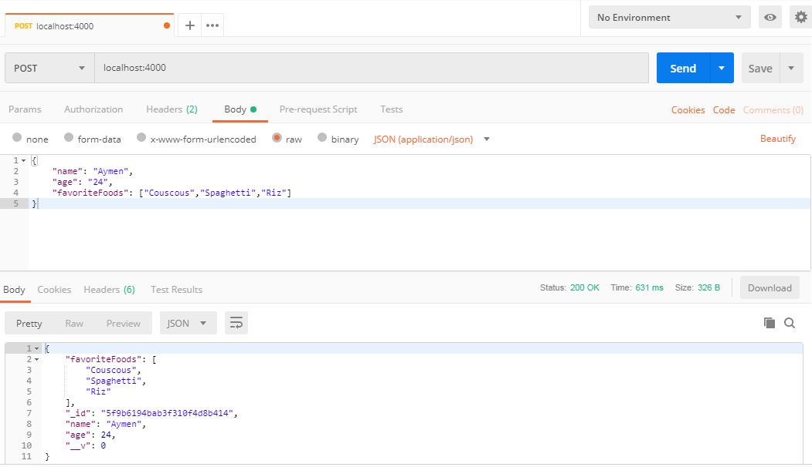

#### Create Many Records with model.create()

Sometimes you need to create many instances of your models, e.g. when seeding a database with initial data. Model.create() takes an array of objects like [{name: 'John', ...}, {...}, ...] as the first argument, and saves them all in the db.

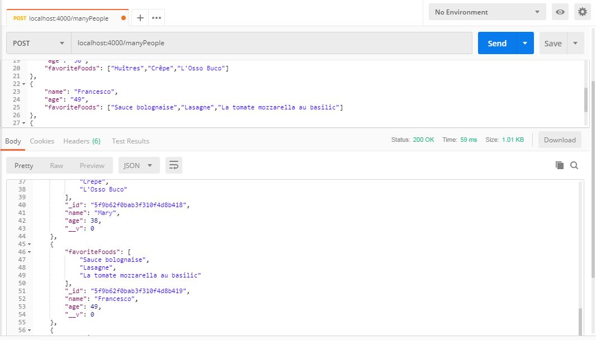
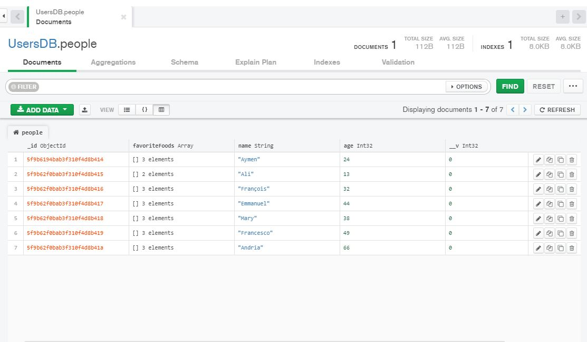

#### Use model.find() to Search Your Database

Find all the people having a given name, using Model.find() -> [Person]

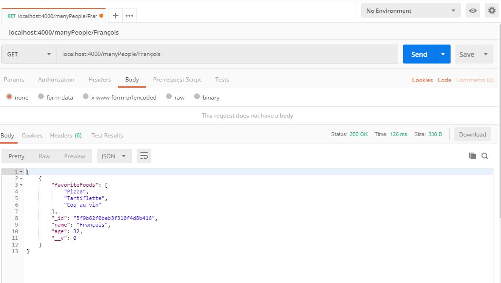

#### Use model.findOne() to Return a Single Matching Document from Your Database

Find just one person which has a certain food in the person's favorites, using Model.findOne() -> Person. Use the function argument food as search key.

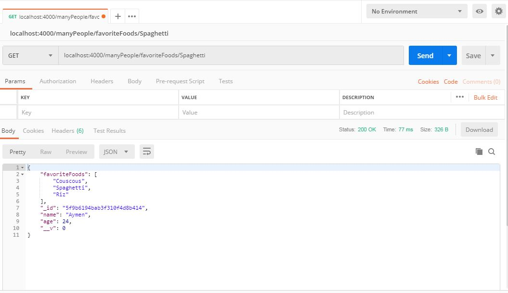

#### Use model.findById() to Search Your Database By _id

Find the (only!!) person having a given _id, using Model.findById() -> Person. Use the function argument personId as the search key.

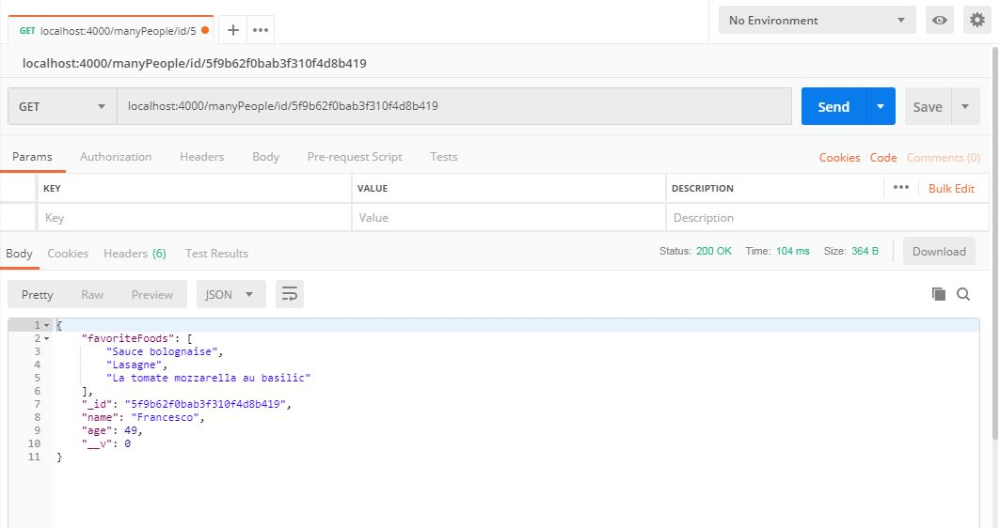

#### Perform Classic Updates by Running Find, Edit, then Save

Find a person by _id ( use any of the above methods ) with the parameter personId as search key. Add "hamburger" to the list of the person's favoriteFoods (you can use Array.push()). Then - inside the find callback - save() the updated Person.

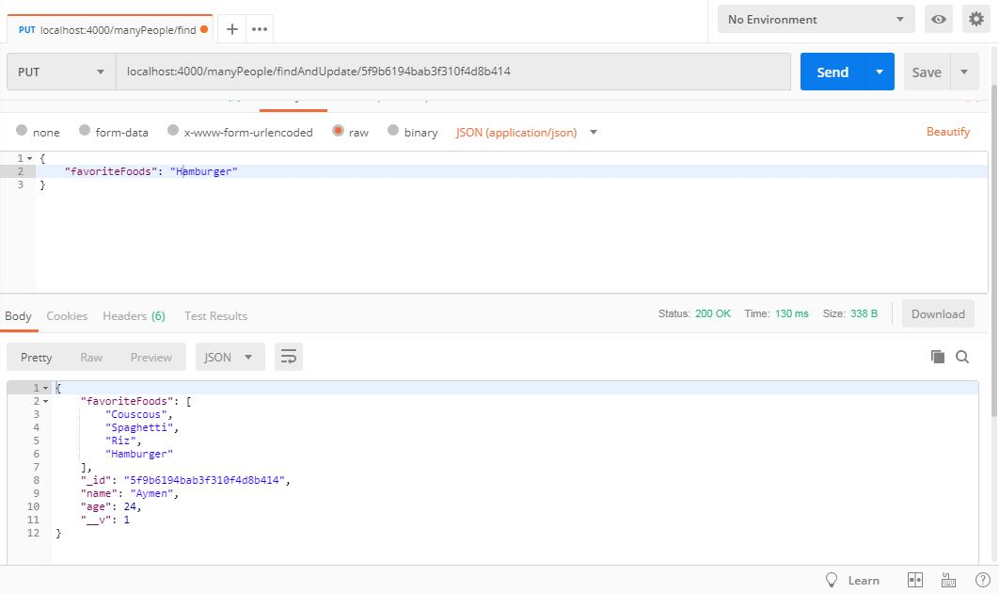

#### Perform New Updates on a Document Using model.findOneAndUpdate()

Find a person by Name and set the person's age to 20. Use the function parameter personName as search key.

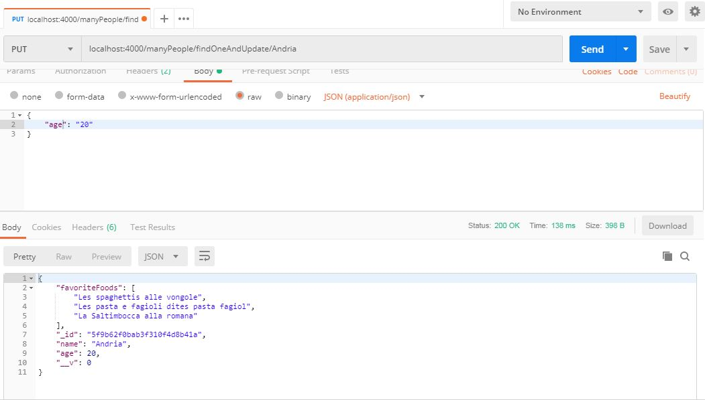

#### Delete One Document Using model.findByIdAndRemove

Delete one person by the person's _id.

#### MongoDB and Mongoose - Delete Many Documents with model.remove()

Delete all the people whose name is “Mary”, using Model.remove(). Pass it to a query document with the name field set, and of course a callback.

Note: The Model.remove() doesn’t return the deleted document, but a JSON object containing the outcome of the operation, and the number of items affected. Don’t forget to pass it to the done() callback, since we use it in tests.

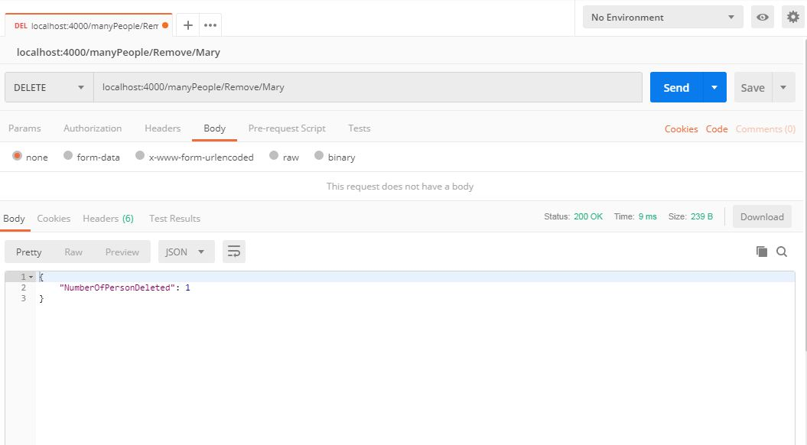

#### Chain Search Query Helpers to Narrow Search Results

Find people who like Riz. Sort them by name, limit the results to two documents, and hide their age. Chain .find(), .sort(), .limit(), .select(), and then .exec(). Pass the done(err, data) callback to exec().

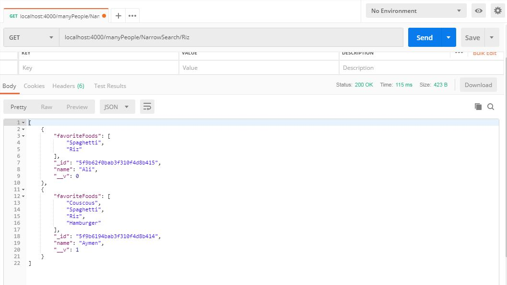

#### Collection After Modification

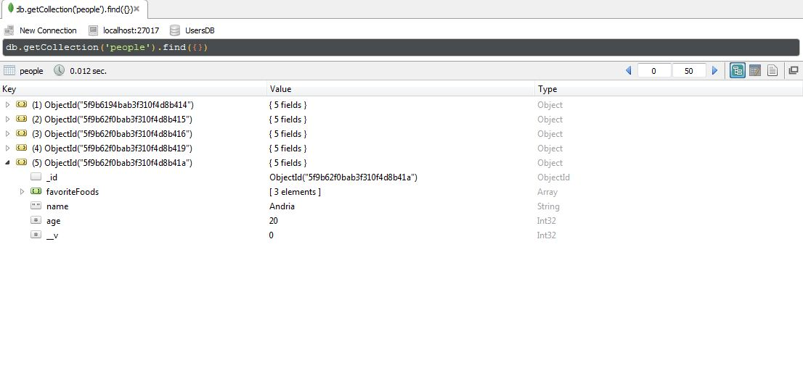